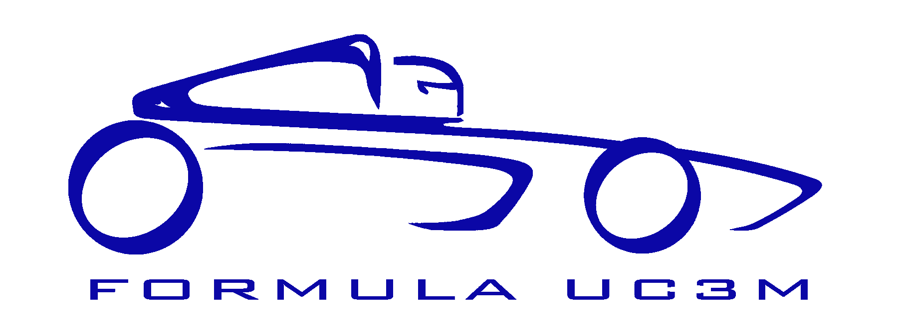

# Fórmula UC3M

> Proyecto para la realización de la telemetría al monoplaza de la UC3M

Proyecto para la realización de las mediciones de los sensores del monoplaza con el fín de poder ver en tiempo real resultados que ayuden al equipo a optimizar los ajustes del mismo.

Además, todos los datos generados serán almacenados en la nube para luego poder ser explotados con el objetivo de mejorar carrera a carrera.

**Motivación**

Como no podía ser de otra manera, los compañeros de la UC3M y OSWeekends nos encontramos en el evento del [T3chfest 2018](https://t3chfest.uc3m.es/2018/) y hablando hablando... nos vinimos arriba y les propusimos echarles una mano con la telemetría.

Para nosotros era un reto tecnológico que se salia fuera de nuestro control ya que no es una de nuestras especialidades que usemos en nuestro día a día porque engloba hardware (arduino), comunicaciones(radio / 4g) y datos en tiempo real, así que fué una cosa que molaba la idea, ¡y mucho!

Al minuto 1 ya empezamos a desvariar sobre las cosas que ibamos a realizar, todo fluía por ambas partes, todo ello aderezado por un ambiente muy bueno, y aquí nos teneis.... ¡sacando el proyecto adelante!

Esperamos que a los que leáis estas líneas os haya cautivado la idea y os unáis a nosotros en este reto tan interesante que se sale de todos nuestros esquemas habituales.

### Equipo

Nota: Nos dividimos en tres equipo dentro del guild para este proyecto:
- Team Formula, compuesto por los Alumn@s y profesor@s de FOrmula UC3M
- Team ArduData, compuesto por gente de OSW centrada en extraer los datos del coche
- Team VisualData, compuesto por gente de OSW centrada en la representación de los datos en tiempo real en el cliente final

**Team ArduData y Team VisualData**
Los integrantes de los equipos son:
 - [Javier Gallego (@bifuer)](https://github.com/bifuer) (leader ArduData) Fullstack
 - [Ulises Gascón (@UlisesGascon)](https://github.com/UlisesGascon) (contributor) Fullstack
 - [Sebastián Cabanas (@Sediug)](https://github.com/Sediug) (leader ArduData) Fullstack
 - [Bryan McEire (@mceire)](https://github.com/mceire) (contributor) Fullstack
 - [Carlos Hernandez (@CodingCarlos)](https://github.com/CodingCarlos) (leader VisualData) Fullstack
 - [Alfredo de la Calle (@ByteLovers)](https://github.com/bytelovers) (contributor) Fullstack
 - [Jonathan Martín (@jonasync)](https://github.com/jonasync) (Leader VisualData) Frontend

**Team Formula**
 - [Daniel Gómez (@dagomezl)](https://github.com/dagomezl) Líder del equipo Formula UC3M
 - [Rubén Moreno (@rubenmoreno94)](https://github.com/rubenmoreno94) Encargado de la telemetría del equipo Formula UC3M

**Servidor de datos en tiempo real (en desarrollo)**
Puedes ver cómo va el desarrollo del servidor de datos en tiempo real [aquí](/server#readme)

##### Agradecimientos
- [Carlos Crisóstomo Vals @Kr0n0](https://github.com/Kr0n0) 
- Resto del equipo [Formula UC3M](http://formulauc3m.com)

### Tecnología utilizada

#### Dependencias

**Hardware**
- **Arduino MEGA** Lectura de sensores del coche
- **Raspberry Pi** Gestion de la comunicación del coche a nuestro backend via internet

**Front-end**
- **Vue.js**: Gestión de datos entre Back y front..
- **D3.js**: Visualización de la información en forma de graficos potentes

**Back-end**
- [**Goku**](http://guilds.osweekends.com/): [Guild](https://github.com/OSWeekends/Guilds) que se encarga de hosting para el backend en la infraestrcutura de OSW, incluyendo subdominios...
- [**MongoDB**](https://www.mongodb.com/es): Almacenamiento de datos para consulta en tiempo real.
- [**Mosca**](https://github.com/mcollina/mosca/wiki): Broker [MQTT](https://geekytheory.com/que-es-mqtt) para [NodeJS](https://nodejs.org/en/).
- [**Pillars**](http://pillarsjs.com/): Framework de desarrollo web para Node.js.

### Cómo contribuir en el proyecto
Puedes participar de infinitas formas...

**Más informacion en [CONTRIBUTING.md](CONTRIBUTING.md)**

### Estado del proyecto.

Actualmente nos encontramos en fase de conceptualización. Estamos en el sprint 0 del proyecto, en la cual se espera que para el siguiente sprint ya tengamos las tecnologías y los materiales a nuestro alcance (Fin 30 de Marzo).

[Aquí](https://github.com/OSWeekends/formula-uc3m/milestone/1) puedes ver la carga de trabajo actual

### Licencia

[GNU Affero General Public License v3.0](https://github.com/OSWeekends/formula-uc3m/blob/master/LICENSE)

